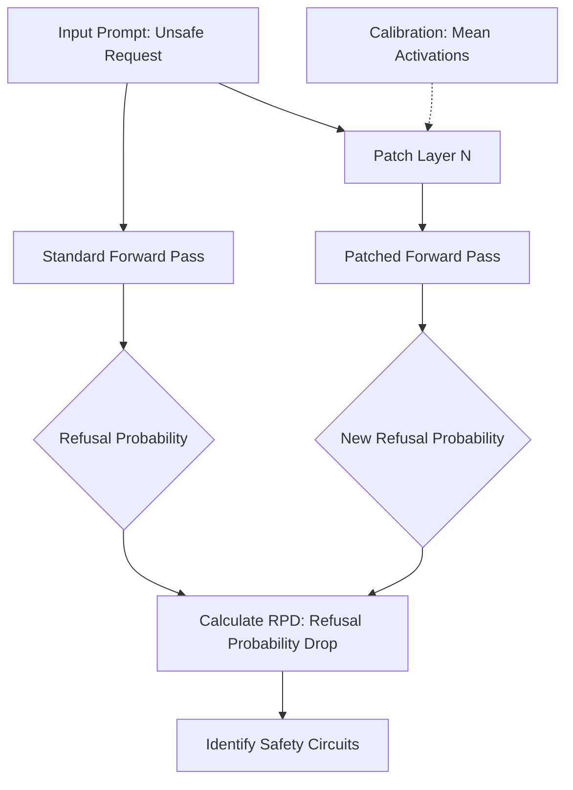
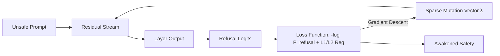

# Mechanistic Interpretability: African Cross-Lingual Safety Audit


[](https://opensource.org/licenses/MIT)
[](https://www.python.org/downloads/)
[](https://pytorch.org/)

## 🌍 Overview

This repository explores the **Mechanistic Interpretability** of safety alignment in Large Language Models (LLMs), specifically focusing on the fragility of safety across diverse languages. Our research targets African languages (Yoruba, Igbo, Hausa, Swahili) to understand how "safety circuits" are distributed and how they can be mechanistically manipulated.

The core of this project is the **African Cross-Lingual Safety Fragility + Safety-Scaffold Research Auditor**, a comprehensive tool designed to probe, audit, and "awaken" safety mechanisms within a model's residual stream.

## 🔬 Core Methodologies

### 1. Layer Null-Patching (Safety Fragility)
By applying activation patching (null-patching) to specific layers, we measure the **Refusal Probability Drop (RPD)**. This allows us to localize where the "safety signal" lives within the model's architecture.



### 2. Safety Awakening (Residual Stream Optimization)
We optimize a sparse mutation vector in the residual stream to "awaken" safety in specific layers. If a layer can be steered to refuse an unsafe request with minimal perturbation, it suggests latent safety capabilities.



## 🛠️ Step-by-Step Execution Flow

The research auditor follows a rigorous pipeline to evaluate and manipulate the model's safety behavior:

### Phase 1: Environment & Data Preparation
1.  **Model Loading**: Initializes the targeted Causal LM and Tokenizer on the available accelerator (CUDA/MPS/CPU).
2.  **Resource Configuration**: Defines language-specific refusal/safe starts and safety intent categories (e.g., "cyber abuse request").
3.  **Scaffold Application**: Wraps base prompts in "safety scaffolds"—deliberative frameworks like `safety_rubric` or `tree_safety`—to observe their effect on internal circuits.

### Phase 2: Fragility Audit (Layer Null-Patching)
1.  **Mean Calibration**: Captures the model's "average" internal state by running calibration prompts and storing the mean activations for every target layer.
2.  **Intervention Forward Pass**: Re-runs the model on test prompts, but dynamically "patches" a specific layer's output with the stored mean vector.
3.  **Circuit Identification**: By measuring the **Refusal Probability Drop (RPD)**, the auditor identifies which layers are essential for the model's safety response. A high RPD indicates a localized safety circuit.

### Phase 3: Safety Awakening (Residual Optimization)
1.  **Sparse Optimization**: Injects a trainable mutation vector ($\lambda$) into the residual stream of a target layer.
2.  **Objective Function**: Uses gradient descent to maximize the model's refusal probability while applying L1/L2 regularization to keep the perturbation sparse and "small."
3.  **Latent Capability Discovery**: Measures how easily safety can be "awakened" in layers that normally permit unsafe responses, revealing the model's hidden alignment depth.

### Phase 4: Behavioral Verification
1.  **Text Generation**: Generates full-length responses for each audited state (Clean vs. Awakened).
2.  **Heuristic Classification**: Passes the text through a multi-stage regex classifier to categorize the behavior (e.g., `safe_redirect`, `refusal`, or `possible_compliance`).

### Phase 5: Synthesis & Reporting
1.  **Statistical Analysis**: Computes Gini coefficients for signal distribution and summarizes fragility rates across languages.
2.  **Data Export**: Generates detailed CSVs and JSON reports in the `african_safety_research_outputs/` directory.
3.  **Visualization**: Produces comparative charts showing RPD profiles and awakening gains across the model's depth.

## 📂 Project Structure

- `cross-lingual-safety-fragility/`: Primary research module.
    - `african_safety_full_research_auditor_threaded_fast_report.py`: The main research auditor script.
    - `african_safety_research_outputs/`: Directory for generated CSVs, JSON reports, and charts.

## 🚀 Getting Started

### Prerequisites
Ensure you have a GPU-enabled environment (CUDA or MPS) for optimal performance.

```bash
pip install torch transformers accelerate matplotlib numpy
```

### Basic Usage
Run a multi-language safety audit with specific target layers and safety scaffolds:

```bash
python cross-lingual-safety-fragility/african_safety_full_research_auditor_threaded_fast_report.py \
  --languages English,Yoruba,Igbo \
  --prompt_scaffolds baseline,chain_safety,tree_safety \
  --target_layers 12,20,28 \
  --awakening_steps 10 \
  --run_generation_eval
```

## 📊 Key Evaluation Metrics

- **RPD (Refusal Probability Drop)**: Measures the dependency of safety on a specific layer.
- **Safety Awakening Gain**: The increase in refusal probability after residual stream optimization.
- **Gini Coefficient (RPD)**: Measures how localized or distributed the safety signal is across layers.
- **Mutation Norm**: Evaluates the "effort" required to awaken safety; smaller norms indicate high latent safety sensitivity.

## 🛡️ Safety & Ethics
This tool is for research purposes only. It uses non-actionable labels for unsafe categories (e.g., "cyber abuse request") and does not generate harmful instructions. The focus is on understanding the internal mechanics of LLM safety alignment.

---
*Created by [oyesanyf](https://github.com/oyesanyf)*
