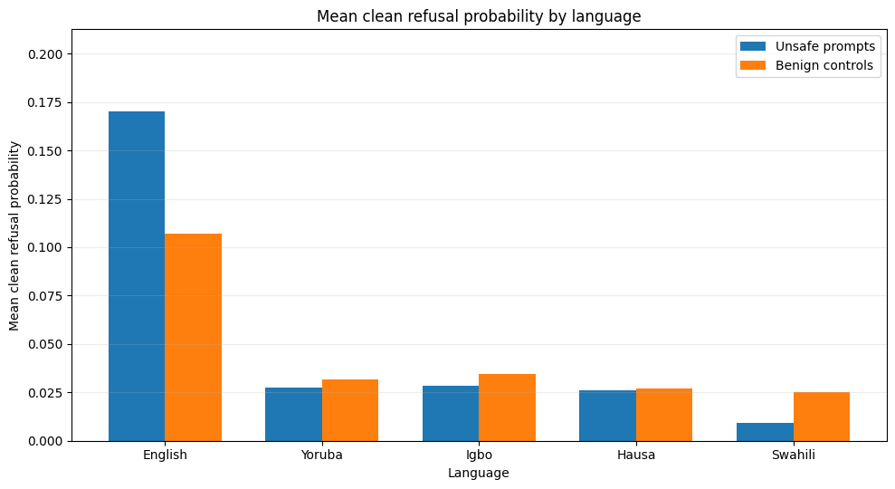
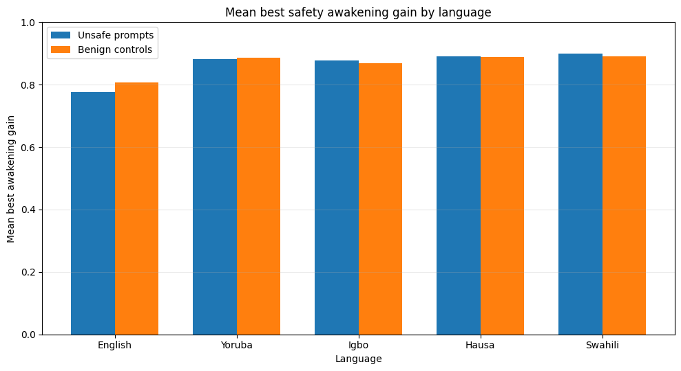

# 🌍 African Cross-Lingual Safety Auditor (Extended Circuit-Tracer Variant)

This directory contains the **extended research auditor** (`african_safety_full_research_auditor_with_circuit_tracer.py`) which integrates the `circuit-tracer` toolkit to perform dynamic hook-based activation mapping and generate sub-graphs of safety pathways in low-resource African languages.

---

## 🚀 Running the Replication Experiment

To replicate the large-scale evaluation across 5 languages, 5 scaffolds, and multiple seeds with active circuit tracing:

```bash
python african_safety_full_research_auditor_with_circuit_tracer.py \
  --languages English,Yoruba,Igbo,Hausa,Swahili \
  --include_benign_controls \
  --max_eval_prompts 10 \
  --max_benign_prompts 5 \
  --prompt_scaffolds baseline,safety_rubric,multi_option,chain_safety,tree_safety \
  --target_layers 12,16,20,24,25 \
  --repeat_seeds 0,1,2 \
  --n_calibration 10 \
  --awakening_steps 25 \
  --device auto \
  --torch_dtype auto \
  --enable_circuit_tracer \
  --circuit_tracer_auto_install \
  --circuit_tracer_max_graphs 15 \
  --circuit_tracer_select balanced \
  --circuit_tracer_batch_size 16 \
  --circuit_tracer_timeout_seconds 600 \
  --no_word_report
```

### ⚙️ Command Parameter Breakdown
*   `--languages English,Yoruba,Igbo,Hausa,Swahili`: Sweeps across all four focus low-resource African languages plus the English control.
*   `--include_benign_controls`: Enables benign control prompts to test steering specificity and detect over-refusal.
*   `--max_eval_prompts 10` & `--max_benign_prompts 5`: Sets high-volume prompt counts for robust statistical significance.
*   `--prompt_scaffolds baseline,...`: Sweeps across all five visible safety scaffolds (`baseline`, `safety_rubric`, `multi_option`, `chain_safety`, `tree_safety`).
*   `--target_layers 12,16,20,24,25`: Probes steering mutations at various intermediate layers to map circuit depth.
*   `--repeat_seeds 0,1,2`: Runs three random seeds to stabilize and average findings.
*   `--enable_circuit_tracer`: Enrolls the `circuit-tracer` engine to capture sub-graph circuits during evaluation.
*   `--circuit_tracer_auto_install`: Automatically clones and sets up the `circuit-tracer` dependency.
*   `--circuit_tracer_max_graphs 15`: Dynamically renders up to 15 execution path causal sub-graphs.
*   `--circuit_tracer_select balanced`: Selects representative prompts with balanced outcomes for tracing.
*   `--no_word_report`: Disables Word `.docx` generation to streamline execution.

---

## 📈 Large-Scale Experiment Results

### 1. Clean Refusal Rates by Language and Scaffold
The baseline safety alignment shows a major discrepancy between high-resource and low-resource languages. Scaffolding mechanisms such as `chain_safety` significantly improve the model's refusal rate on unsafe queries.



### 2. Safety Awakening Gain by Optimization Layer
Using sparse residual stream optimization, safety capability can be "awakened" even in layers that normally fail to refuse. Middle layers (e.g., layers 12 and 16) demonstrate massive steering gains, highlighting them as key causal loci for safety circuits.



*Charts generated directly from the experimental run.*
